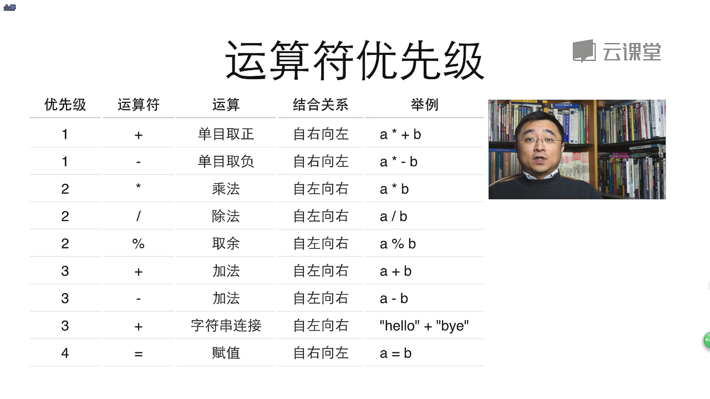

- 在Java的世界当中有一些传统的做法，比如说类的名字通常都会采用第一个字母是大写的名字
- Java语法里面每一句话最后面需要有一个分号作为结尾
- 任何一个程序其实都可以看作是有输入然后做一些计算进行输出的一个过程
- 可以用“+”去连接两个字符串，一个字符串可以是固定的，另外一个字符串可以是一个变量，由用户输入
- 有两个in.nextInt()，那么计算机就需要从用户那里读取两个数字后再进行运算

- 上述这行代码的意思是给amount一个初始值0，而没有赋给price一个初始值
- 从软件工程的角度来讲，一行里面最好只定义一个变量，这样对于今后代码的维护和阅读都是有好处的
- Exception就是抛出的异常的意思

- 当两个整型变量在作除法的时候，它的结果只能是一个整型

- 浮点的变量我们需要使用double来表达

- 单目的意思是说这个运算中只有一个操作数

